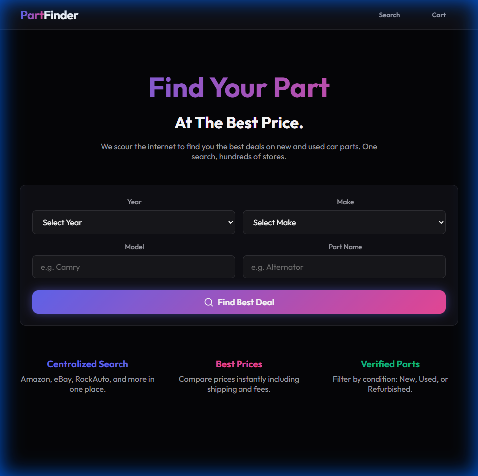
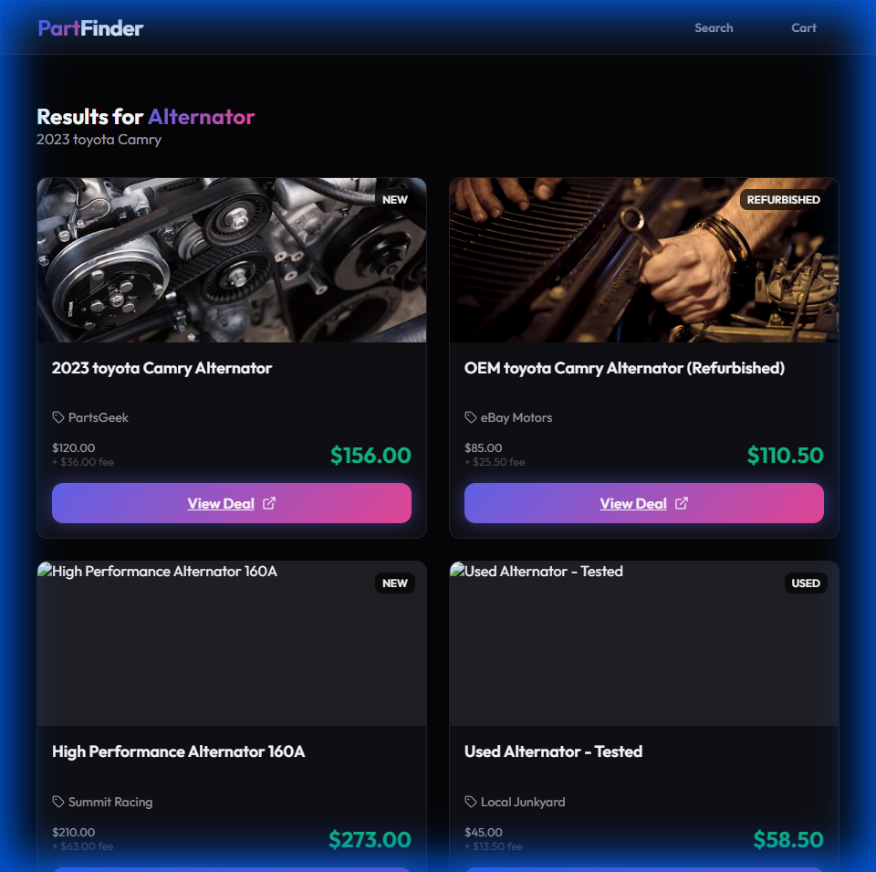

# PartFinder

**PartFinder** is your centralized hub for automotive parts. We scour the internet's most popular marketplaces and parts stores (Amazon, eBay, RockAuto, and more) to find you the best deals on new, used, and refurbished parts—all in one app.

## 📱 Mobile-First Experience
Designed for the garage and the go. Our interface implements a premium, dark-themed glassmorphism aesthetic that looks stunning on your phone.

## 🚀 Key Features

*   **Centralized Search Engine**: Stop jumping between 10 tabs. Enter your vehicle details once and search everywhere.
*   **Transparent Pricing**: We calculate the total cost upfront. Our service fee (20-30%) ensures we can keep finding you the best quality parts.
*   **Verified Listings**: Filter effortlessly by Condition (New, Used, Refurbished).
*   **Smart Comparison**: Instantly compare prices across different vendors to ensure you never overpay.

## 📸 App Showcase

### Smart Search
Enter your Year, Make, Model, and Part Name to instantly scour the web.



### Comprehensive Results
View results from multiple stores in a clean, unified grid. Prices are clearly broken down with service fees included.



### Live Demo
Watch PartFinder in action:


## 🛠 Tech Stack

*   **Frontend**: React (Vite)
*   **Styling**: Vanilla CSS (CSS Variables, Glassmorphism, Advanced Animations)
*   **Icons**: Lucide React
*   **Backend**: Supabase (Postgres, Auth, Edge Functions) _[In Progress]_

## 🏁 Getting Started

### Prerequisites

*   Node.js (v20+)
*   NPM

### Installation

1.  Clone the repository:
    ```bash
    git clone https://github.com/yourusername/partfinder.git
    cd partfinder
    ```

2.  Install dependencies:
    ```bash
    npm install
    ```

3.  **Setup Backend (Supabase)**
    *   Create a project on [Supabase.com](https://supabase.com).
    *   Get your `Project URL` and `anon public key`.
    *   Create a `.env` file in the root directory:
        ```env
        VITE_SUPABASE_URL=your_project_url
        VITE_SUPABASE_ANON_KEY=your_anon_key
        ```

4.  Start the development server:
    ```bash
    npm run dev
    ```
    Open [http://localhost:5173](http://localhost:5173) in your mobile or desktop browser.

## 🤝 Contribution

We welcome contributions! Please feel free to submit a Pull Request.
